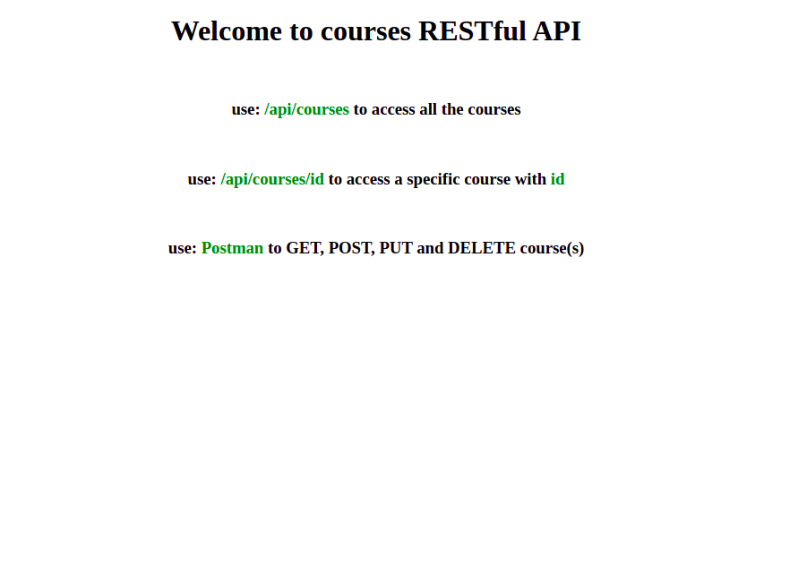

# Courses RESTful API

> A restFull API allows the user to get all course , get one course by id, update or delete a course.

## Table of contents

- [General info](#general-info)
- [Screenshots](#screenshots)
- [Technologies](#technologies)
- [Setup](#setup)
- [Features](#features)
- [Status](#status)
- [Inspiration](#inspiration)
- [Contact](#contact)

## General info

> A simple RESTful API . the objective is using `express` , `node` , and `Postman` to create and test RESTful API and read and write to `json` file using the file system `fs` in node.

## Screenshots



## Technologies

- Node 14.5.5
- Nodemon 2.0.7
- Express 4.17.1
- VSC code
- JavaScript
- Postman
- Heroku

## Setup

- `npm install`

- `npm start`

- use `Postman` to `GET`, `POST` , `PUT` and `DELETE` courses

## Code Examples

```js
"use strict";

//DELETE a course by id
app.delete("/api/courses/:id", (req, res) => {
  fs.readFile(PATH_COURSES, "utf-8", (err, data) => {
    if (err) {
      console.log(err);
    }

    const parsedData = JSON.parse(data);
    const courses = parsedData.courses;

    const course = courses.find(
      (element) => element.id === parseInt(req.params.id)
    );

    if (!course) {
      res
        .status(404)
        .send(`the course with the id ${req.params.id} dose not existed`);
      return;
    }

    const courseIndex = courses.indexOf(course);
    courses.splice(courseIndex, 1);
    res.send(course);

    const stringifyCourses = JSON.stringify(parsedData, null, 2);

    // write the new changes to course.json
    fs.writeFile(PATH_COURSES, stringifyCourses, (err) => {
      if (err) {
        res.status(500).send(err);
        return;
      }
      console.log(" the course has been deleted successfully");
    });
  });
});
```

## Features

List of features ready and Todos for future development

-
-
-

To-do list:

-
-

## Status

Project is: _in progress_

## Inspiration

How to build a REST API with Node js & Express by [Mosh]

## Contact

By [HYF - Group 3]
