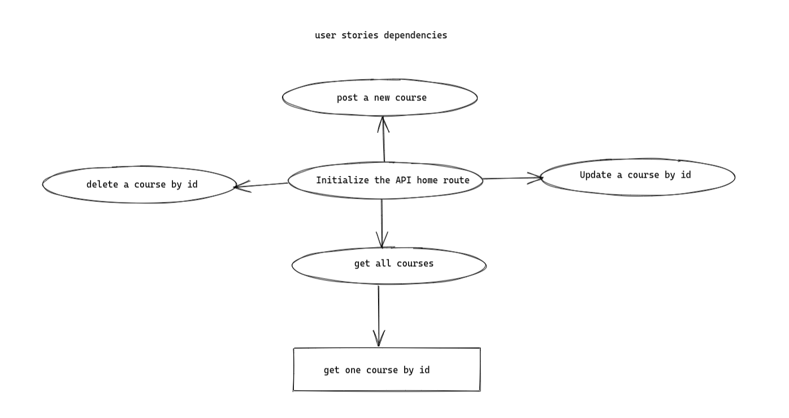

# Courses RESTful API

> A simple RESTful API allow the user to get course , get one course , update a course and delete a course

---

## Data

> describe the data used in your project.
>
> - what properties?
> - what types?
> - what are array entries like?
>   Data `courses.json` are a json object contains an array with object for each course.

---

## User Story Dependencies

---

<!--## WIREFRAME

-->

---

## 0.Setup

- create a new repo from the template `todo-list-restful-pjs`
- turn on GitHub pages
- add collaborators
- add a simple README.md file
- add a first strategy plan

---

## 1. home route `/`

**As a user I want to be able to see the home route of courses API**

### REPO

- This user story is developed on branch `1-homeRoute`.
- This branch is merged to `master` branch after completion.

### Task A

`courses.json`

- create a file `courses.json` .
- add data to `courses.json`

### Task B

`index.js`

- this issue developed on a branch `1-homeRoute`
- add json file to `index.js` .
- require `express`, `Joi`, `fs`
- create a new home route with some instructions for users

---

## 2. get all courses

**As a user I want to be able to get all courses**

### REPO

- This user story is developed on branch `2-getAll`.
- This branch is merged to `master` branch after completion.

### Task A

`index.js`

- this issue developed on a branch `2-getAll`
- create a new route `/api/courses`
- use `fs` to read from json file
- parse the data and send them with status 200

---

## 3. get one course by id

**As a user I want to be able to get one course by id**

### REPO

- This user story is developed on branch `3-getOne`.
- This branch is merged to `master` branch after completion.

### Task A

`index.js`

- this issue developed on a branch `3-getOne`
- use the parsed data and access the courses array
- find a the courses with the requested `id`
- if the course dons not existed send status `404`
- send the requested course

---

## 4. post a new course

**As a user I want to be able to post a new course **

### REPO

- This user story is developed on branch `4-post`.
- This branch is merged to `master` branch after completion.

### Task A

`index.js`

- this issue developed on a branch `4-post`
- validate the request `body`
- if it is not valid send status `400` and exit
- use `fs` to read form json file
- parse the data and access the courses array
- push the new course to the array
- stringy the updated courses
- use `fs` to write to json file

---

## 5. put(update) a course

**As a user I want to be able to update a course **

### REPO

- This user story is developed on branch `5-put`.
- This branch is merged to `master` branch after completion.

### Task A

`index.js`

- this issue developed on branch `5-put`
- validate the update course
- use `fs` to read form json file
- find the requested course
- if it does not existed send status`404`
- update the course name
- stringy the update courses
- use `fs` to write to json file

---

## 6. delete a course by id

**As a user I want to be able to delete a course **

### REPO

- This user story is developed on branch `6-delete`.
- This branch is merged to `master` branch after completion.

### Task A

`index.js`

- this issue developed on branch `6-delete`
- use `fs` to read form json file
- find the requested course
- if it does not existed send status`404`
- find the `index of` the requested course and `splice` it
- stringy the update courses
- use `fs` to write to json file

---

## 7- final check

- make sure , everything is working probably
- test routes with `Postman`
- final README.md
- deploy to `Heroku`
